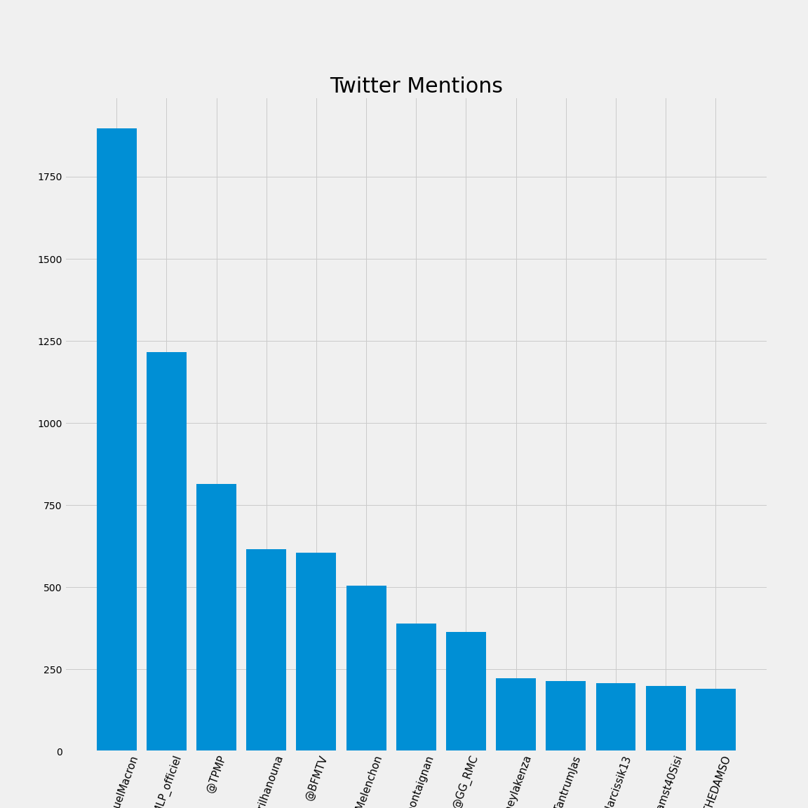

# French Tweets
In 2017, Emmanuel Macron and Marine Le Pen were the final two candidates in the French Presidential Election. The two candidates had drastically different approaches to governing, and as such, the election was a major topic of discussion on Twitter.

## Data Cleaning
**For Mentions**
Tweets from three days of April 2017 were provided in a json file. In order to access the information the json file was read into a spark resilient distributed dataset (rdd). 

The rdd was converted into a json dictionary and the 'text' key was used to include the only text of each tweet. This rdd was further cleaned to include only words starting with '@' which corresponds to the mentions of other twitter handles. The sortByKey was used to create a count of the mentions of each twitter user. 

**For Macron vs Le Pen Mention Comparison**
The same tweets from three days in April 2017 were read into a spark dataframe. This dataframe was reduce, using SQL, to include only the text and the timestamp from each tweet. The tweets were filtered to count the number of mentions for each candidate and grouped into hours. 

## Plots

By comparing mentions of both presidential candidates we can see the eventual winner of the election . 

